# Double-descent in system identification


Next, we explore the double-descent phenomena in the context of system identification. This is the 
companion code to the paper ([https://arxiv.org/abs/2012.06341](https://arxiv.org/abs/2012.06341)):
```
Beyond Occam’s Razor in System Identification: Double-Descent Phenomena when Modeling Dynamics.
Antônio H. Ribeiro, Johannes N. Hendriks, Adrian G. Wills, Thomas B. Schön, 2020.
arXiv: 2012.06341
```

BibTex formatted citation:
```
@misc{ribeiro2020occams,
      title={Beyond Occam's Razor in System Identification: Double-Descent when Modeling Dynamics}, 
      author={Antônio H. Ribeiro and Johannes N. Hendriks and Adrian G. Wills and Thomas B. Schön},
      year={2020},
      eprint={2012.06341},
      archivePrefix={arXiv},
      primaryClass={cs.LG}
}
```

## Requirements:

We use standard packages: Numpy, Scipy, Pandas, Scikit-learn, Pytorch and Matplotlib...
The file `requirements.txt` gives the version under which the repository was tested against,
but we believe the code might still compatible with older versions of these packages.

## Folder structure:

- `models.py`: Contain the implementation of the available models to be
tested. Options are:

| Models  | Description |
|:-------:|-----------:| 
| RBFSampler | Approximates feature map of an RBF kernel by Monte Carlo approximation of its Fourier transform (See [here](https://scikit-learn.org/stable/modules/generated/sklearn.kernel_approximation.RBFSampler.html)).|
| RBFNet | Radial basis function network.  |
| RandomForest | A random forest regressor (See [here](https://scikit-learn.org/stable/modules/generated/sklearn.ensemble.RandomForestRegressor.html)).|
| FullyConnectedNet | A n-layer fully conected neural network implemented in pytorch. |
| LinearModel | Linear model adjusted by least-squares|


- `datasets.py`: Contain implementations of available datasets to be used in the experiments. Also contain
methods and abstract classes to help in the implementation of new artificially generated datasets.

| Datasets  | Description |
|:-------:|-----------:| 
| ChenDSet| Nonlinear dataset (generated artificially). See Ref. [1]|
| Order2LinearDSet | Linear second order dataset (generated artificially).|
| CoupledEletricalDrives | Nonlinear dataset collected from physical system: see [here](https://sites.google.com/view/nonlinear-benchmark/benchmarks/coupled-electric-drives?authuser=0).|

The module can also be called from the command line as an script:
```bash
python datasets.py --dset [DSET]
```
which will plot the input and output from the dataset. Where `[DSET]` is one of the options in the table above.

- `plot_predictions.py`: train/load model, evaluate on dataset, compute metric
and plot prediction on the specified split. Run it as:
```
python plot_predictions.py
```
with the option ``--dset [DSET]`` specifying the dataset (check the table above for available options); 
``--split [SPLIT]`` where `SPLIT` is in `{train, test}` specify which split is being evaluated.
``--tp [TP]`` where `TP` is in `{pred, sim}` specify  weather one-step-ahead or free-run-simulation
is being used. Use `--help` to get a full list of options.

- `narx_double_descent.py`: train model and evaluate on dataset for varying number of features. Run it as:
```
python narx_double_descent.py
```
with the option ``--dset [DSET]`` specifying the dataset (check the table above for available options); 
``--nonlinear_model [MDL]`` specifying the model (all the options in the table above are available, except for linear model); 
``--output [FILE]``  specify where to save the results. By default save in `performance.csv`.
Use `--help` to get a full list of options.

- `plot_double_descent.py`: generate plot of performance *vs* model size curve, using the output 
of `narx_double_descent.py`. Run it as:
```
python plot_double_descent.py [FILE]
```
where `FILE` is the file generated by `narx_double_descent.py`.

- `generate_repository_figures.sh`: generate all figures that displayed in this README.md file and place them in `img/`. 

- `generate_paper_figures.sh`: generate all the figures used in the paper `Beyond Occam’s Razor in System Identification:
 Double-Descent Phenomena when Modeling Dynamics.`There is some overlap with the figures generated by the last command.
 However, this commands, yield the figures with the exact same style and size used in the paper.
 
## Datasets
In the paper we focus on the two datasets:
### ChenDSet
   Generate nonlinear system described in Chen et al (1990). One example of input and correspondent output generated by such a system is displayed next:
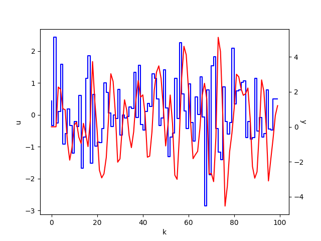
```bash
# The above plot can be generated by running:
python datasets.py --dset ChenDSet
```
### CoupledEletricalDrive 

Nonlinear system described in Wigren et al (2017). One example of input and correspondent output generated by such a
system is displayed next:

|  PRBS Sequence |  Uniform Sequence| 
|:--------------------:|:---------------:|
|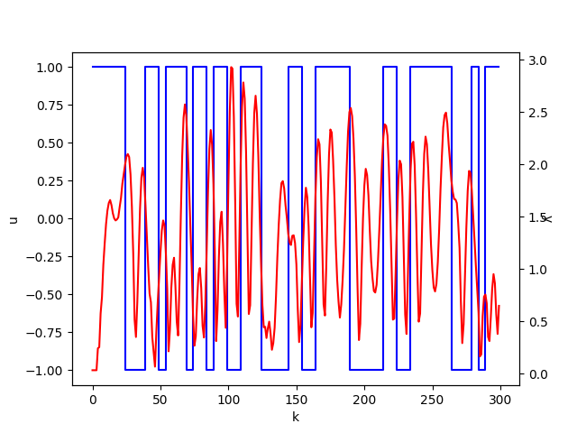 |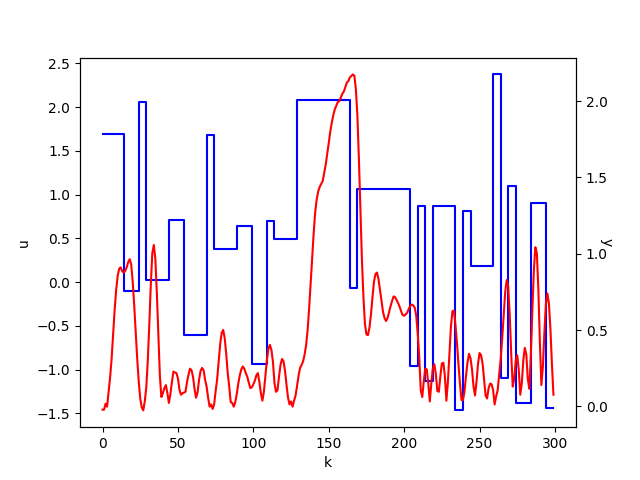 |

```bash
# The above plot can be generated by running:
 python datasets.py --dset CoupledElectricalDrives --sequence 0
 python datasets.py --dset CoupledElectricalDrives --sequence 3
```

# Experiments

Next we describe some experiments where we observed the double descent phenomenon. The
table bellow describes: the model; whether the model is linear in the parameters or nor; th dataset; where the experiment is referenced in the
paper 
`Beyond Occam’s Razor in System Identification: Double-Descent Phenomena when Modeling Dynamics`.


| | Model |  Lin.-in-the-param.| Dataset | Overp. Solution|  Reference in the paper|
|:-------:|:----------:|:----------:|:----------:|:----------:|:----------:|
| [\#1.](#chen-rff-minnorm) | RBFSampler | Yes| ChenDSet |  Minimun-norm |  Fig. 2  | 
| [\#2.](#chen-rff-ridge) | RBFSampler | Yes| ChenDSet |  Ridge   |   Fig. 3  | [here](#chen-rff-) |
| [\#3.](#chen-rff-ensembles) | RBFSampler | Yes| ChenDSet |  Ensembles  |  Fig. 4  | [](#chen-rff-) |
| [\#4.](#chen-rbfnet-ridge) | RBFNet | Yes| ChenDSet |  Ensembles  |   Fig. 5  | [2.](#chen-rff-) |
| [\#5.](#ce8-rff-ridge) | RBFSampler | Yes | CE8 |   Ensembles  |  Fig. 1  | [2.](#chen-rff-) |
| [\#6.](#chen-randomforest) | Random Forest | No | ChenDSet |   Ensembles  |  Fig. 6  | [2.](#chen-rff-) |

The command `python narx_double_descent.py` can take more than 30 min in some of the examples bellow.
For convenience, the csv output files that would be generated as output are made available in
the folder `results/` is. So skip to the command if you want to reuse those pre-computed results
or reduce -n [N] and -r [R] if you want a partial result faster. 


## \#1. Random Fourier Features using Minimum Norm Solution <div id='chen-rff-minnorm'/>


Next we show the double descent both for one-step-ahead error (left) and for free-run simulation 
error (center), as well as the norm of the parameters (right). The baseline is the performance of a linear model.

| One-step-ahead error | Free-run simulation error | Parameter Norm | 
|:--------------------:|:-------------------------:|:--------------:|
|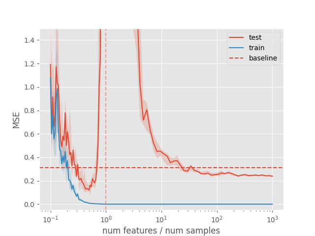|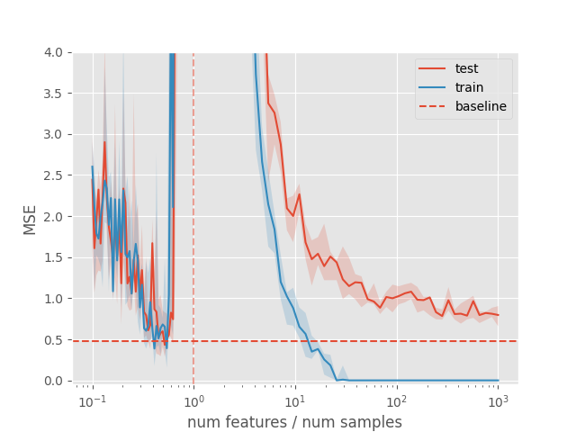 |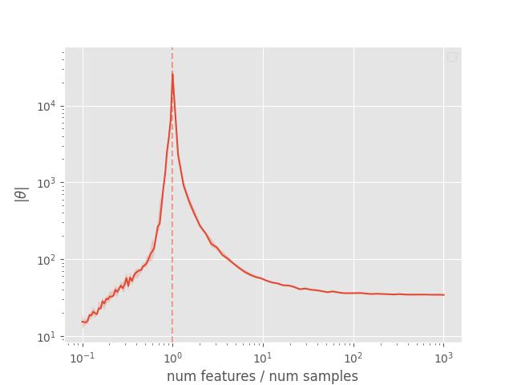 |

```bash
# The above plots can be generated by running:
# 1. Generating results
DSET="-d ChenDSet --cutoff_freq 0.7 --hold 1 --num_train_samples 400"
MODEL="-m RBFSampler  --gamma 0.6"
python narx_double_descent.py $DSET $MODEL -n 100 -r 10 -u 3 -o results/chen/rbfsampler.csv  
# 2. Plotting:
python plot_double_descent.py results/chen/rbfsampler.csv --tp pred --ymax 1.5 --plot_style ggplot # left plot (<-) 
python plot_double_descent.py results/chen/rbfsampler.csv --tp sim --ymax 4.0 --plot_style ggplot # center plot (<>) 
python plot_double_descent.py results/chen/rbfsampler.csv --tp norm --plot_style ggplot  # right plot (->) 
```

Next, we show plots of the model free-run simulation in the test set
in the interpolation and classical regions. More the best RBFSampler in 
each region from all the runs above. This should help geting a
better sense of how the model perform on each point of the curve.

| Before interpolation threshold (`# features = 149 `) | After interpolation threshold (`# features = 40000 `)|
|:--------------------:|:-------------------------:|
|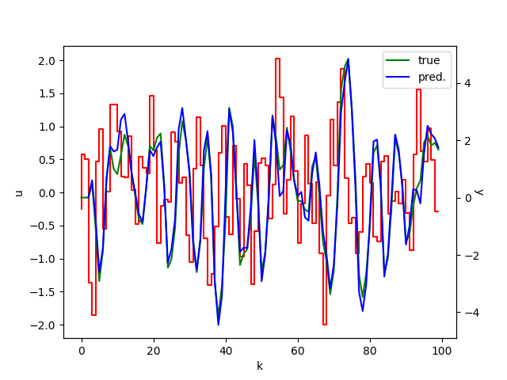|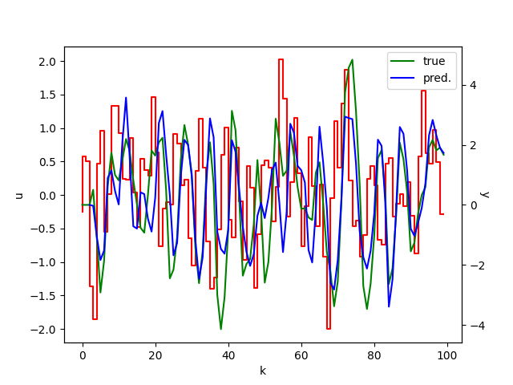 |

```bash
# The above plots can be generated by running:
python plot_predictions.py $DSET $MODEL --n_features 149 --random_state 7  # left plot (<-)
python plot_predictions.py $DSET $MODEL --n_features 40000 --random_state 7 # right plot (->)
```


## \#2. Random Fourier Features and ridge regression <div id='chen-rff-ridge'/>

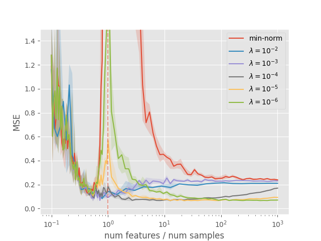

```bash
# The above plots can be generated by running:
# 1. Generating results
DSET="-d ChenDSet --cutoff_freq 0.7 --hold 1 --num_train_samples 400"
MODEL="-m RBFSampler  --gamma 0.6"
for RIDGE in 0.01 0.001 0.0001 0.00001 0.000001 0.0000001;
do
    python narx_double_descent.py $DSET $MODEL -n 100 -r 10 -u 3 -o results/chen/rbfsampler_r"$RIDGE".csv --ridge $RIDGE
done
# 2. Plotting
python  plot_multiple_dd.py results/chen/rbfsampler.csv  results/chen/rbfsampler_r{0.01,0.001,0.0001,0.00001,0.000001}.csv  \
  --labels  "min-norm"  "\$\lambda=10^{-2}\$" "\$\lambda=10^{-3}\$" "\$\lambda=10^{-4}\$" "\$\lambda=10^{-5}\$" "\$\lambda=10^{-6}\$" \
  --ymax 1.5 --plot_style ggplot
```


## \#3. Random Fourier Features and ensembles  <div id='chen-rff-ensembles'/>
 
| One-step-ahead error | Free-run simulation error | Parameter Norm | 
|:--------------------:|:-------------------------:|:--------------:|
|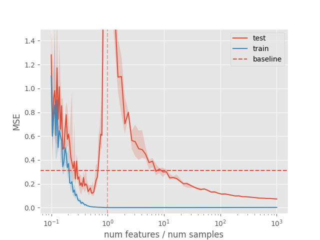|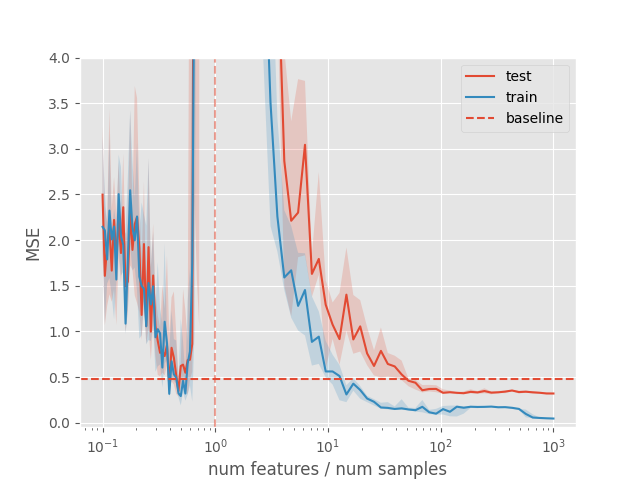 |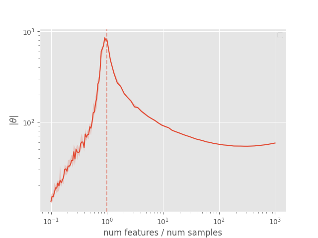 |

```bash
# The above plots can be generated by running:
# 1. Generating results
DSET="-d ChenDSet --cutoff_freq 0.7 --hold 1 --num_train_samples 400"
MODEL="-m RBFSampler  --gamma 0.6  --ridge 0.0000001 --n_ensembles 1000"
python narx_double_descent.py $DSET $MODEL -n 100 -r 10 -u 3 -o results/chen/rbfsample_ensemble.csv
# 2. Plotting
python plot_double_descent.py results/chen/rbfsample_ensemble.csv --tp pred --ymax 1.5 --plot_style ggplot # left plot (<-) 
python plot_double_descent.py results/chen/rbfsample_ensemble.csv --tp sim --ymax 4.0 --plot_style ggplot # center plot (<>) 
python plot_double_descent.py results/chen/rbfsample_ensemble.csv --tp norm --plot_style ggplot  # right plot (->) 
```


## \#4. RBFNet <div id='chen-rbfnet-ridge'/>

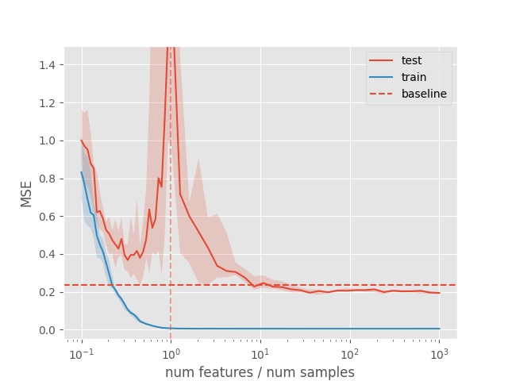

```bash
# The above plots can be generated by:
# 1. Generating results
DSET="-d ChenDSet --cutoff_freq 0.5 --hold 1 --num_train_samples 400"
MODEL="-m RBFNet  --gamma 0.25 --spread 5.0  --ridge 0.00000000000001 --n_ensembles 2000"
python narx_double_descent.py $DSET $MODEL -n 60 -r 10 -u 3 -o results/chen/rbfnet.csv
# 2. Plotting:
python plot_double_descent.py results/chen/rbfnet.csv --tp pred --ymax 1.5 --plot_style ggplot
```

## \#5. Double-descent experiments with CE8 dataset <div id='ce8-rff-ridge'/>

Next we show how different model classes can display double descent
behaviour on this dataset.


Next we show the double descent both for one-step-ahead error (left) and for free-run simulation 
error (center), as well as the norm of the parameters (right). The baseline is the performance of a linear model.

| One-step-ahead error | Free-run simulation error | Parameter Norm | 
|:--------------------:|:-------------------------:|:--------------:|
|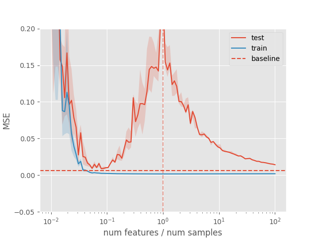|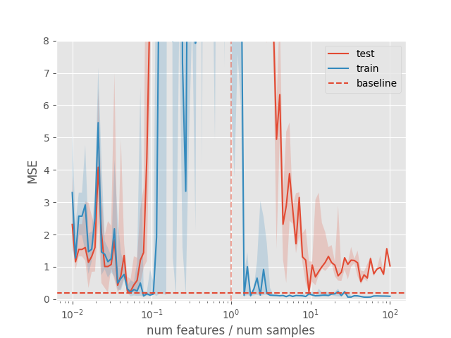 |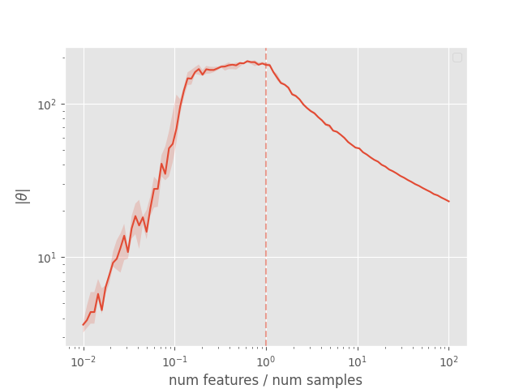 |

```bash
# The above plots can be generated by:
# 1. Generating results
DSET="-d CoupledElectricalDrives --dset_choice unif"
MODEL="-m RBFSampler --gamma 0.2 --ridge 0.000001 --n_ensembles 2000"
python narx_double_descent.py $DSET $MODEL -n 100 -r 10 -l '-2' -u 2 -o results/ce8/rbfsampler.csv  
# 2. Plotting:
python plot_double_descent.py results/ce8/rbfsampler.csv --tp pred --ymax 0.2 --plot_style ggplot # left plot (<-) 
python plot_double_descent.py results/ce8/rbfsampler.csv --tp sim --ymax 8.0 --plot_style ggplot  # center plot (<>) 
python plot_double_descent.py results/ce8/rbfsampler.csv --tp norm --plot_style ggplot # right plot (->) 
```

## \#6. Nonlinear model -  Random Forest <div id='chen-randomforest'/>

Next we show the double descent both for one-step-ahead error (left) and for free-run simulation 
error (right). The baseline is the performance of a linear model.

| One-step-ahead error | Free-run simulation error |
|:--------------------:|:-------------------------:|
|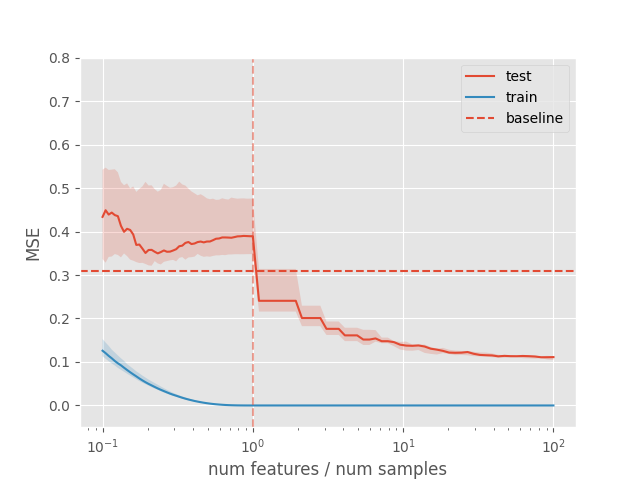|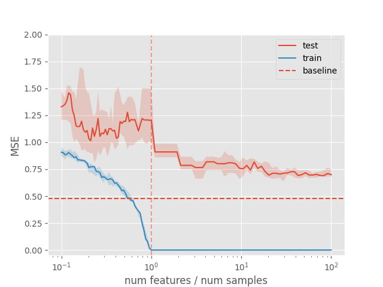 |

```bash
# The above plots can be generated by:
# 1. Generating resultsve plots can be generated by running:
DSET="-d ChenDSet --cutoff_freq 0.7 --hold 1 --num_train_samples 3000"
MODEL="-m RandomForest"
python narx_double_descent.py $DSET $MODEL -n 100 -r 10 -o results/chen/randomforest.csv  
# 2. Plotting:
python plot_double_descent.py results/chen/randomforest.csv --tp pred --ymax 0.8 --plot_style ggplot # left plot (<-)
python plot_double_descent.py results/chen/randomforest.csv --tp sim --ymax 2.0 --plot_style ggplot # right plot (->)
```

Next, we show plots of the model free-run simulation in the test set
in the interpolation and classical regions. More the best Random Forest in 
each region from all the runs above. This should help give a
better sense of how the model perform on each point of the curve.

| Before interpolation threshold (`# features = 252 `) | After interpolation threshold (`# features = 20000 `)|
|:--------------------:|:-------------------------:|
|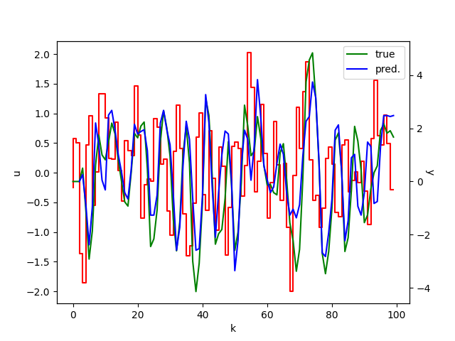|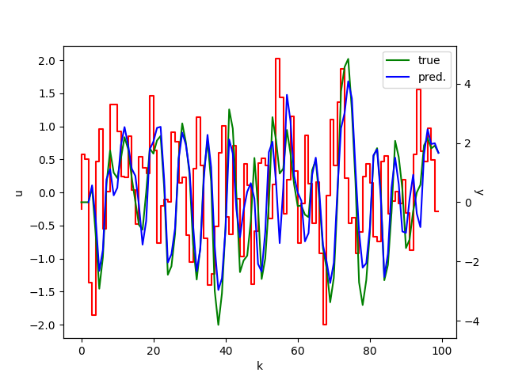 |

```bash
# The above plots can be generated by running:
python plot_predictions.py $DSET $MODEL --n_features 600 --random_state 5  # left plot (<-)
python plot_predictions.py $DSET $MODEL --n_features 200000 --random_state 9  # right plot (->)
```

## Additional Datasets and Model

We focused in giving the commands for reproducing the paper examples.
There are, however, some datasets and models that were not explored in the paper and that were made available 
here (i.e., `FullyConnectedNet`, `Order2LinearDSet`). 

The fully connected neural network model is implemented using [PyTorch](https://pytorch.org/), and it allows 
the use of the GPU when it is available (make sure to install the PyTorch built with CUDA suport if you want to make use of this).

# References

- [1] Chen,  S.,  Billings,  S.A.,  and  Grant,  P.M.  (1990).   Non-Linear  System  Identification  Using  Neural  Networks.International Journal of Control, 51(6), 1191–1214. doi:10/cg8bhx.  01127.
- [2] Wigren,  T.  and  Schoukens,  M.  (2017).   Coupled  electric drives data set and reference models. Technical  Report. Uppsala Universitet, 2017